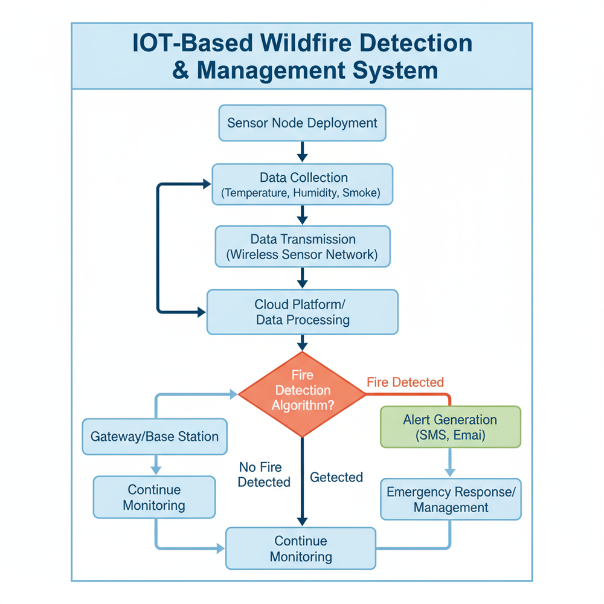
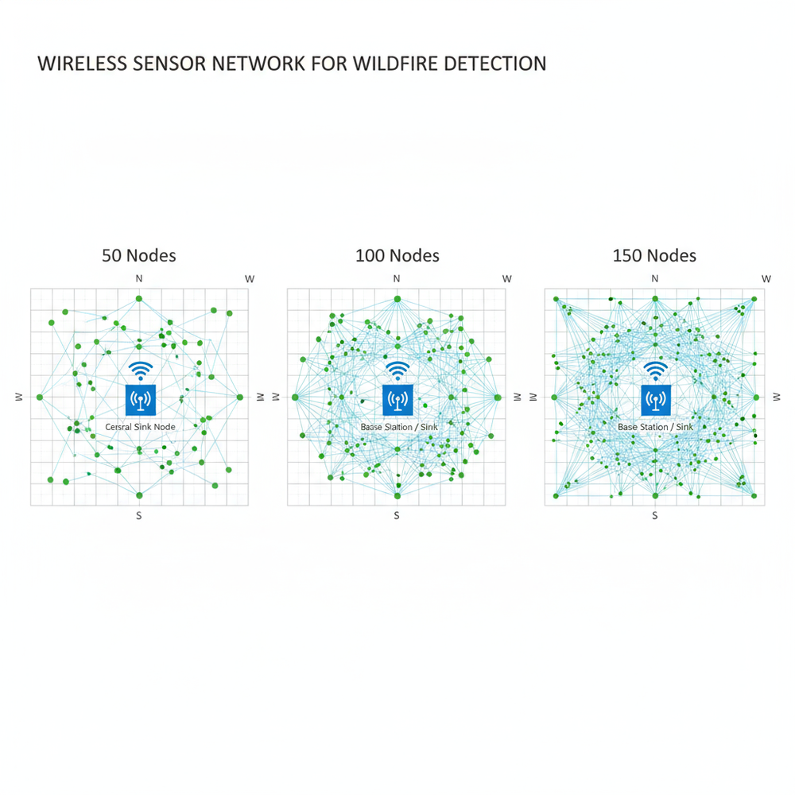
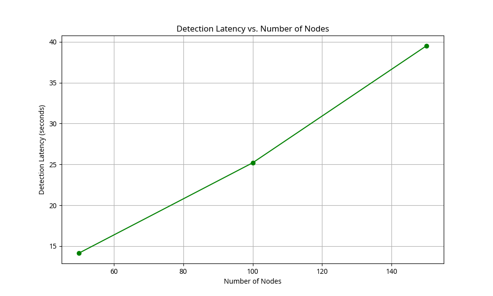

# IoT-Based Wildfire Detection & Management System (2025) 🌲🔥

 

An advanced **IoT-driven framework** designed for the early detection and management of wildfires using **Wireless Sensor Networks (WSN)** and **Edge AI**. This project bridges the gap between environmental safety and intelligent network systems.

---

## 🚀 Project Overview
Wildfires represent a critical natural hazard requiring rapid response. This system integrates real-time environmental monitoring with intelligent data analysis to classify fire risks at their earliest stages, significantly reducing detection latency compared to traditional satellite methods.

### Key Objectives:
- **Early Detection:** Real-time analysis of temperature, smoke, and gas levels.
- **Intelligence at the Edge:** Using lightweight ML models for localized decision-making.
- **Network Longevity:** Implementing energy-efficient routing protocols to extend the lifespan of sensor nodes.

---

## 🛠 System Architecture & Design
The system architecture is divided into three main layers: the Perception Layer (Sensors), the Network Layer (WSN), and the Intelligence Layer (Edge Computing).

### 📐 System Flowchart
The following flowchart illustrates the logical sequence of data acquisition, processing, and fire classification:

*Figure 1: Comprehensive System Design and Logic Flow.*

### 🌐 Network Topology
The deployment strategy involves a cluster-based WSN topology to ensure robust data transmission even in dense forest environments:

*Figure 2: WSN Topology and Node Distribution.*

---

## 📊 Technical Specifications & Results

### 🧪 Technology Stack
| Category | Tools & Technologies |
| :--- | :--- |
| **Simulators** | Cooja (Contiki OS), NS-3 |
| **Edge Intelligence** | Python, TensorFlow Lite |
| **Hardware Emulation** | ESP32-based node logic |
| **Communication** | 802.15.4 (Zigbee/6LoWPAN) |

### 📈 Performance Analysis
Our simulation results demonstrate a significant improvement in detection speed and accuracy. Below is an analysis of the detection latency across various network conditions:

*Figure 3: Latency Analysis showing high responsiveness of the integrated ML model.*

---

## 📁 Repository Structure
- `📂 Report/`: Contains the full technical PDF documentation.
- `📂 Simulation/`: Cooja and NS-3 simulation scripts.
- `📂 Codes/`: Python scripts for TensorFlow Lite model training and conversion.
- `📂 Presentation/`: PowerPoint slides for the technical defense.
- `📂 Media/`: High-resolution diagrams, flowcharts, and result plots.

---

## 📚 References
1. **Al-dhubaibi, T. A. (2025).** *IoT-Based Wildfire Detection & Management System*. Department of Telecommunications & Networks Engineering, Faculty of Engineering, Sana'a University.
2. Contiki-NG & Cooja Documentation for WSN Simulation.
3. TensorFlow Lite for Microcontrollers Documentation.

---

## 👨‍🔬 About the Author
**Theyazan A. Al-Dhubaibi** *Telecommunications & Network Engineer | AI Researcher* Founder of **Syncolars for Academic Studies & Research**. Specialized in securing IoT environments and optimizing next-generation networks.

---
*"Driven by innovation, secured by intelligence."*
